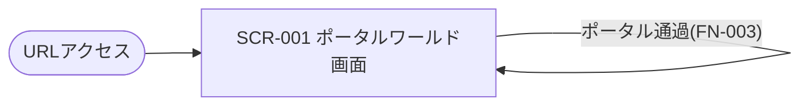

# 画面遷移図

本アプリは単一画面(SPA)で、画面遷移は存在しない。
ワールドの切替(昼⇔夜)は画面遷移ではなく、SCR-001 内の3D空間でのポータル通過によって行われる。

```mermaid
flowchart LR
    Start([URLアクセス]) --> SCR001[SCR-001 ポータルワールド画面]
    SCR001 -- ポータル通過(FN-003) --> SCR001
```
