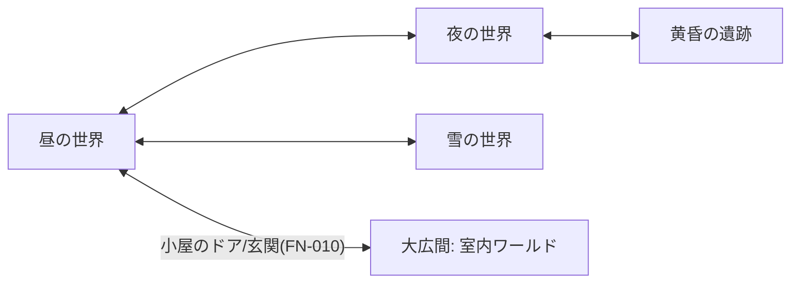

# 画面遷移図

本アプリは単一画面(SPA)で、画面遷移は存在しない。
ワールドの切替は画面遷移ではなく、SCR-001 内の3D空間でのポータル通過(FN-003)によって行われる。
室内ワールド「大広間」も同じポータル機構で行き来する(家のドア=ポータル, FN-010)。

```mermaid
flowchart LR
    Start([URLアクセス]) --> SCR001[SCR-001 ポータルワールド画面]
    SCR001 -- ポータル通過(FN-003) --> SCR001
```

## ワールド接続グラフ(SCR-001 内)

```mermaid
flowchart LR
    day[昼の世界] <--> night[夜の世界]
    night <--> ruins[黄昏の遺跡]
    day <--> snow[雪の世界]
    day <-- 小屋のドア/玄関(FN-010) --> hall[大広間: 室内ワールド]
```
